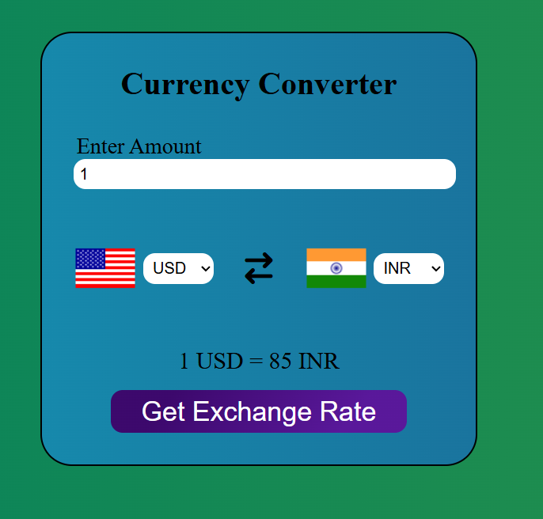
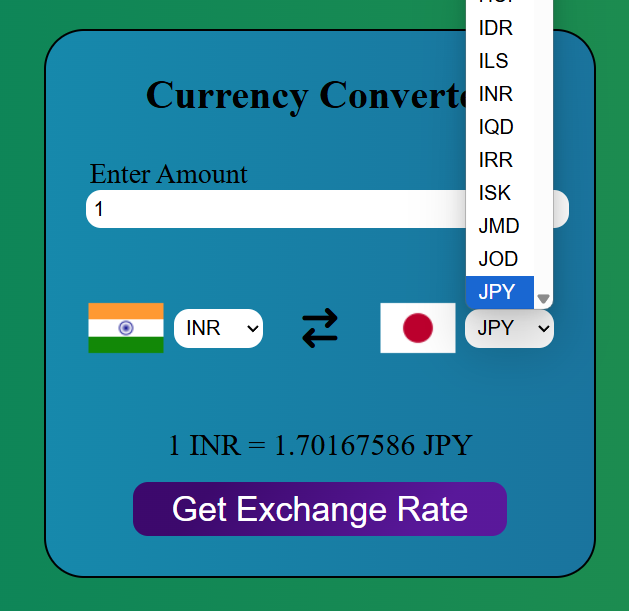

# Currency Converter

A simple, web-based currency converter that allows users to convert between over 100 currencies using real-time exchange rates.

## 🌟 Features

- 🔄 Convert between 100+ currencies  
- 🌐 Real-time exchange rates via [Fawaz Ahmed's Currency API](https://github.com/fawazahmed0/currency-api)  
- 🏳️ Country flags displayed for selected currencies  
- 📱 Responsive and modern user interface  

## 🖼️ Demo

### 🎥 Demo Video

[▶️ Watch the Demo](Demo/Demo.mp4)

### 📸 Screenshots

#### 📌 Home Interface


#### 📌 Currency Selection & Conversion


## 🚀 How to Use

**Clone the repository**
   ```sh
   git clone https://github.com/your-username/currency-converter.git
   ```
## 📁 Project Structure
```
├── app.js             # Main JavaScript logic
├── codes.js           # Currency code and country mapping
├── index.html         # Main HTML file
├── style.css          # Stylesheet
├── Demo/
│   └── Demo.mp4       # Demo video
└── ScreenShots/
    ├── Home.png       # Home interface
    └── Exchange.png   # Conversion result
```

## Credits

- [Fawaz Ahmed's Currency API](https://github.com/fawazahmed0/currency-api) for exchange rates
- [FlagsAPI](https://flagsapi.com/) for country flags
- [Font Awesome](https://fontawesome.com/) for icons

- **Made with ❤️ by Himanshu Gupta**
