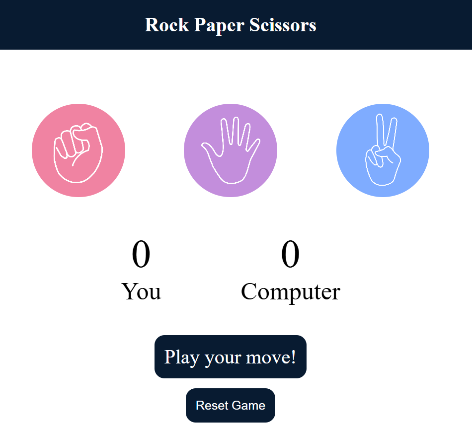
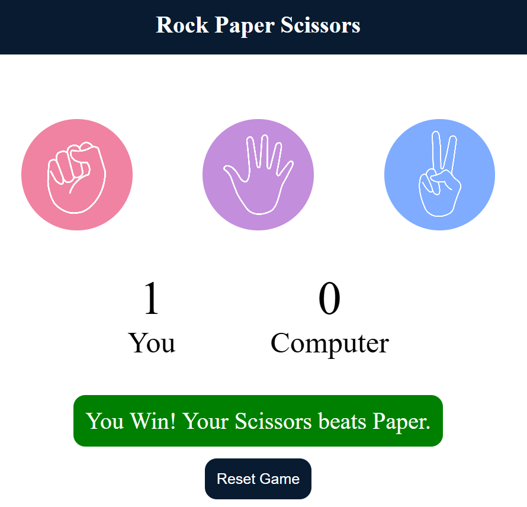
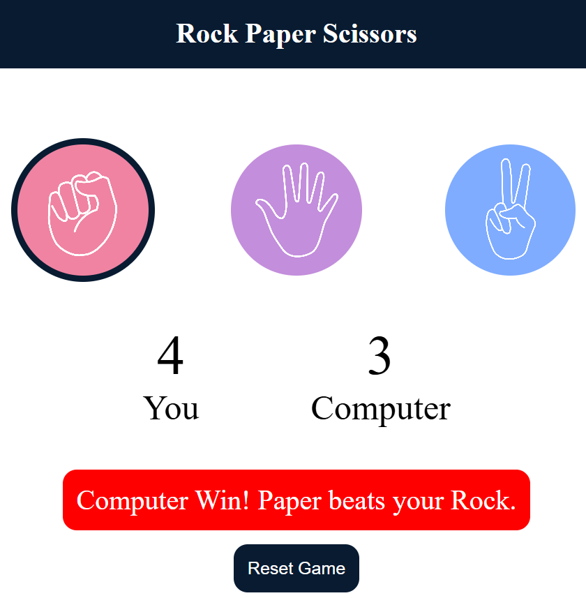
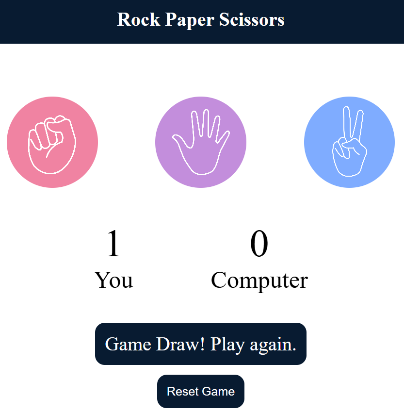

# 🪨📄✂️ Rock Paper Scissors Game

A simple and interactive Rock-Paper-Scissors game built using **HTML**, **CSS**, and **JavaScript**.

## 🎮 Features

- 🎲 Play Rock, Paper, Scissors against the computer  
- 📊 Live score tracking for user and computer  
- ✨ Visual feedback for wins, losses, and draws  
- 🔄 Reset button to restart the game  
- 📱 Responsive and interactive UI  

## 📸 Screenshots

### 🏠 Home Screen


### 🧑 User Wins


### 💻 Computer Wins


### 🤝 It's a Draw!


## 🎥 Demo Video

[▶️ Watch the Demo](Demo/Demo.mp4)

<video width="100%" controls>
  <source src="Demo/Demo.mp4" type="video/mp4">
  Your browser does not support the video tag.
</video>

## 🚀 Getting Started

**Clone the repository or download the ZIP.**

   ```sh
   git clone https://github.com/your-username/rock-paper-scissors-game.git
   cd rock-paper-scissors-game
   ```
## 📁 Project Structure
```
├── RockPaperScissor.html     # Main HTML file
├── RockPaperScissor.css      # Styling
├── RockPaperScissor.js       # Game logic
├── Images/                   # Icons for rock, paper, scissors
│   ├── rock.png
│   ├── paper.png
│   └── scissors.png
├── ScreenShots/              # Game state screenshots
│   ├── Home.png
│   ├── User Win.png
│   ├── Comp Win.png
│   └── Draw.png
└── Demo/
    └── Demo.mp4              # Gameplay demo video
```
## 🕹️ How to Play

1. **Click** on **Rock**, **Paper**, or **Scissors** to make your move.  
2. The **computer randomly selects** its move.  
3. The **result** (win, lose, or draw) is displayed, and **scores are updated**.  
4. Click the **Reset** button to **start a new game**.

**Made with ❤️ by Himanshu Gupta**
