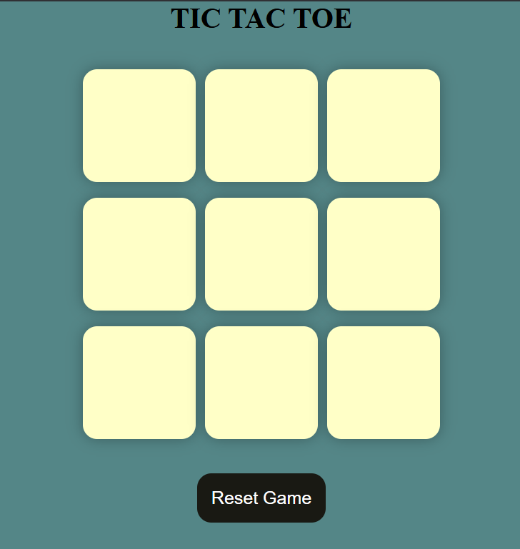
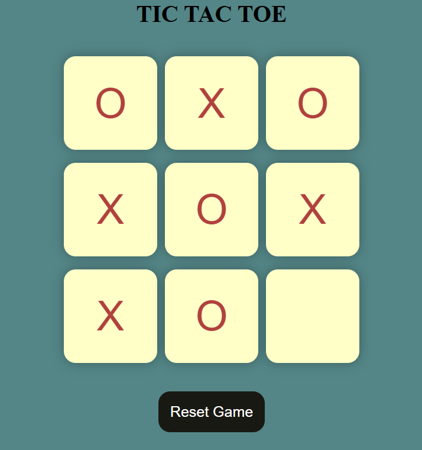

# ❌⭕ Tic-Tac-Toe Game

A simple, responsive Tic-Tac-Toe game built using **HTML**, **CSS**, and **JavaScript**.

---

## ✨ Features

- 🎮 Two-player gameplay (X and O)
- 🧠 Automatically detects win and draw conditions
- 🔁 Reset and New Game functionality
- 📱 Fully responsive design for desktop and mobile
- 🧼 Clean and modern user interface

---

## 📸 Screenshots

### 🎲 Game in Progress


### 🏁 Win or Draw State


---

## 🎥 Demo Video

[▶️ Watch the Demo](Demo/Demo.mp4)

> 📁 Make sure the `Demo/Demo.mp4` file exists in the correct path when opening locally.

---

## 🕹️ How to Play

1. **Open `TicTacToe.html` in your web browser.**
2. Players take turns clicking on empty grid cells to place their mark.  
   - Player O goes first.
3. The game automatically detects if a player has won or if the game ends in a draw.
4. Click the **New Game** button to start a new round, or **Reset Game** to reset scores and the board.

---

## 📁 Project Structure
```
├── 📄 TicTacToe.html       # Main HTML file
├── 📄 TicTacToe.css        # Stylesheet
├── 📄 TicTacToe.js         # Game logic (JavaScript)
├── 📁 Demo/
│ └── 🎥 Demo.mp4           # Demo video
└── 📁 ScreenShots/         # Screenshots
├── 🖼️ 1.png # Screenshot 1
└── 🖼️ 2.png # Screenshot 2
```
---

**🕹️ Made with ❤️ by Himanshu Gupta**
